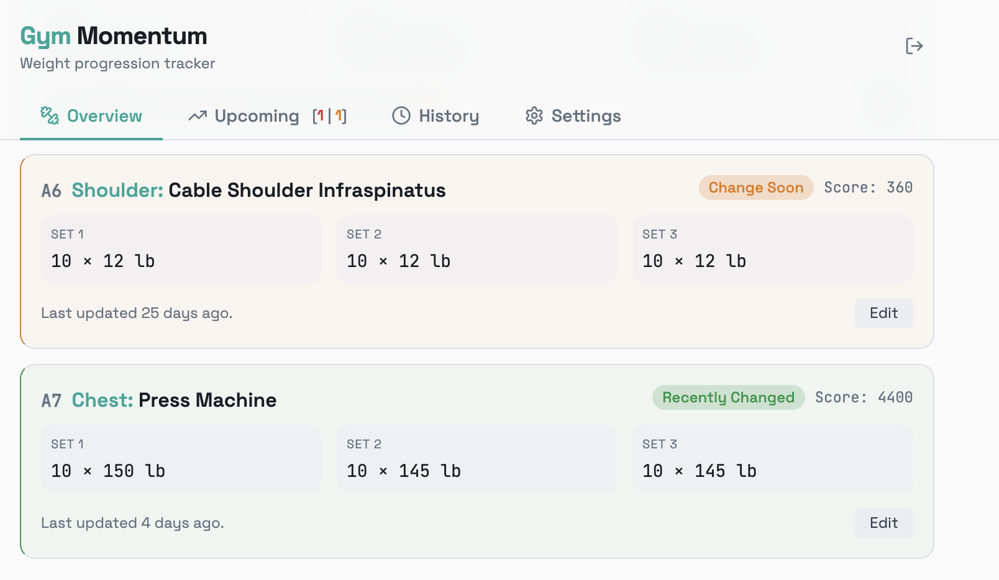
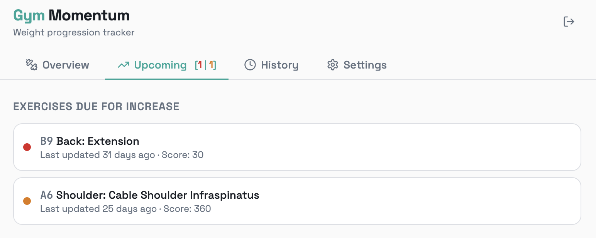
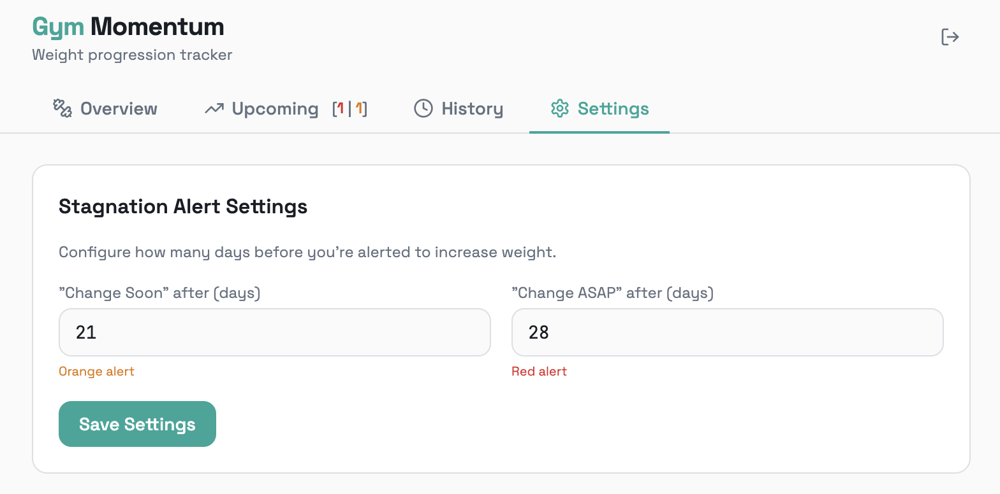

# Gym Momentum

A personal workout tracking app I designed and built to solve a problem I actually had: knowing *when* to push harder in the gym, not just *what* I did last session.

## The Problem
Most gym trackers log your workouts. Few tell you when you've stopped progressing. I wanted a tool that proactively flags stagnation so I could make intentional decisions about increasing weight or reps.

## What I Built
A web app that tracks exercise performance over time and uses a traffic-light system to surface stagnation alerts before they become bad habits.

**Core features:**
- Set and rep tracking across Push, Pull, and Legs workout groups with automatic score calculation
- Stagnation detection with configurable thresholds and color-coded urgency (green / orange / red)
- Per-exercise progression charts ordered by most recently updated
- Secure authentication with email verification, password reset, and row-level data isolation

## Product Decisions Worth Noting
- **Configurable thresholds** rather than fixed alerts — different training styles have different cadences
- **Badge system on the Upcoming tab** shows at-a-glance counts of urgent vs. soon alerts without requiring navigation
- **Score as reps x weight** keeps progress comparable across set configurations

## Screenshots

Main UI with workout tracking and stagnation alerts:

Upcoming alerts view:

User-configurable alert settings:

## Built With
React, TypeScript, Tailwind CSS, Supabase (auth + database), Recharts
